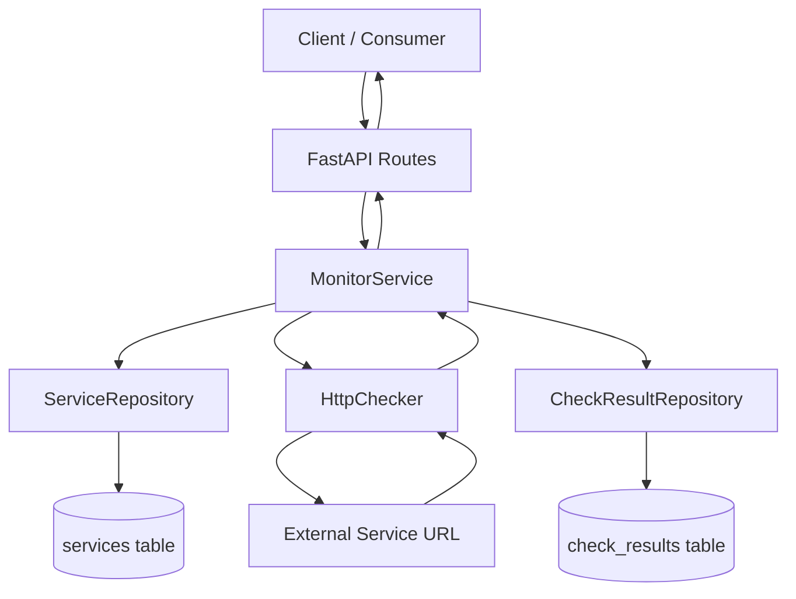

# Service Monitor API

A lightweight FastAPI service that monitors third-party endpoints and stores historical health-check results. The API lets you register services, execute on-demand checks, and retrieve health history for observability and incident response.

## What the Service Does

The project tracks the operational health of external HTTP services by comparing each observed HTTP status code with an expected status configured per service.

For each check execution, the system records:
- Returned HTTP status code (or `null` if request failed)
- Response time in milliseconds
- Availability decision (`is_up`)
- Error message (for network/timeout/runtime failures)
- Check timestamp

## Core Architecture

The codebase follows a **layered architecture** with clear separation of concerns:

- **API Layer (`app/api`)**
  - Exposes REST endpoints via FastAPI.
  - Handles request validation and response serialization.
  - Delegates business operations to service classes.

- **Service Layer (`app/services`)**
  - Implements core monitoring logic.
  - `MonitorService` orchestrates check execution and result persistence.
  - `HttpChecker` performs async HTTP requests and latency measurement.

- **Repository Layer (`app/repositories`)**
  - Encapsulates SQLAlchemy persistence operations.
  - Keeps database access outside API handlers and service logic.

- **Domain/Data Layer (`app/models`, `app/schema`, `app/core`)**
  - SQLAlchemy models for `services` and `check_results` tables.
  - Pydantic schemas for request/response contracts.
  - DB engine/session setup and metadata lifecycle.

## Core Monitoring Logic (Decision Flow)

1. API receives `POST /services/{service_id}/check`.
2. `MonitorService.run_check()` loads the service definition.
3. If service is not found, returns `None` (API layer converts to 404).
4. `HttpChecker.check(url)` executes async GET with:
   - timeout: `10.0s`
   - redirects enabled
5. Checker returns normalized payload:
   - `status`
   - `response_time_ms`
   - `error_message`
6. Monitor service computes:
   - `is_up = status is not None and status == expected_status` (intended behavior)
7. Result is persisted in `check_results`.
8. API returns structured response DTO.

## Conceptual Diagram



## Main Endpoints

Base path: `/api/`

### Health
- `GET /health`
  - Returns API health status.

### Services
- `POST /services`
  - Registers a monitored service.
  - Request body:
    - `name: str`
    - `url: HttpUrl`
    - `expected_status: int = 200`

- `GET /services?skip=0&limit=100`
  - Lists registered services with pagination controls.

### Checks and History
- `POST /services/{service_id}/check`
  - Executes a real-time check for one service and stores the result.

- `GET /services/{service_id}/history?limit=50`
  - Returns historical check results for a service.

## CI Pipeline

Every push or pull request targeting `main` triggers an automated pipeline with two sequential jobs.

### Global settings

The pipeline runs with `permissions: contents: read`, granting the workflow the minimum required access to the repository — it can read code but cannot write or modify anything. A concurrency guard ensures that if a new commit is pushed while the pipeline is already running for the same branch, the in-progress run is cancelled automatically, avoiding redundant work.

### Job 1 — Tests

Sets up Python 3.12 and restores a dependency cache keyed by the hash of `uv.lock`. If the lock file hasn't changed since the last run, all packages are restored instantly from cache instead of being downloaded again. Dependencies are installed with `uv sync --frozen`, which enforces the exact versions declared in the lock file and guarantees that the environment in CI is byte-for-byte identical to the local development environment. The test suite is then executed with `pytest`.

### Job 2 — Docker build and smoke test

Only starts if Job 1 passes — there is no point building an image from broken code.

Builds the Docker image using BuildKit with layer caching backed by the GitHub Actions cache. Layers that haven't changed are reused across runs, keeping build times low. The image is loaded locally into the runner instead of being pushed to a registry, since the goal here is validation, not publication.

Once the container is running, the pipeline polls `GET /openapi.json` up to 20 times over 40 seconds, waiting for the API to be ready. It then hits the root endpoint and asserts that the response body contains the expected `"status"` field. If any step fails, the container logs are printed automatically to aid debugging. The container is always removed at the end of the job, regardless of success or failure, leaving the runner clean.

## Getting Started Locally
 
### Prerequisites
- Python 3.12+
- [uv](https://docs.astral.sh/uv/)
### Run
 
```bash
# 1) Install dependencies
uv sync
 
# 2) Start the development server
uv run uvicorn app.main:app --reload --port 8000
```


## Getting Started with Docker

### Prerequisites
- Docker
- Docker Compose

### Run with docker-compose

```bash
# 1) Go to the project root
cd /path/to/service-monitor-api

# 2) Build and start the API
docker compose up --build
```

The service will be available at:
- `http://localhost:8000`
- OpenAPI docs: `http://localhost:8000/docs`

### Stop the stack

```bash
docker compose down
```

### Persistence

SQLite data is persisted using the bind mount:
- Host: `./data`
- Container: `/app/data`

## Running Tests
 
```bash
uv run pytest -v
```

## Notes

- Tables are created at startup via `Base.metadata.create_all(...)`.
- Current implementation is optimized for simple deployment and local usage.
- For production-grade workloads, consider adding migrations, background scheduling, stronger retry policy, and richer observability.
